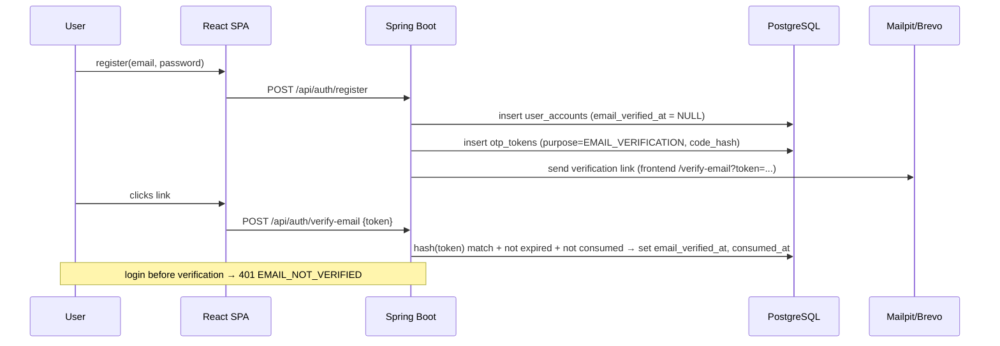
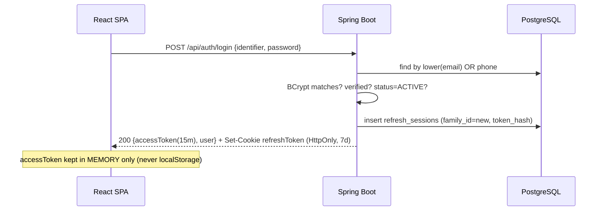
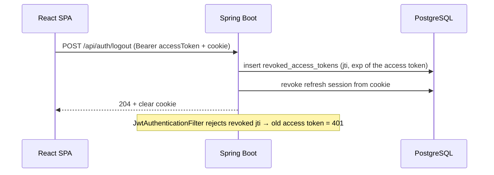
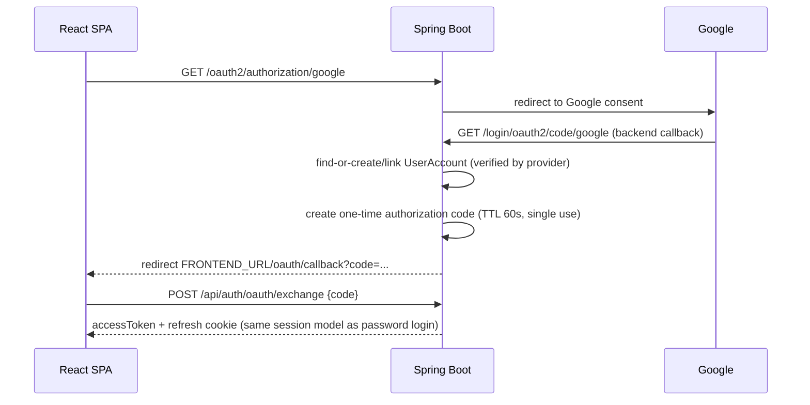

# AUTH FLOWS

## Registration + email verification



## Login (email or normalized phone + password)



## Refresh rotation + reuse detection

```mermaid
sequenceDiagram
    participant FE as React SPA
    participant BE as Spring Boot
    participant DB as PostgreSQL

    FE->>BE: POST /api/auth/refresh (cookie)
    BE->>DB: find refresh_sessions by hash(token)
    alt valid & active & not expired
        BE->>DB: revoke old session; insert new session (same family_id)
        BE-->>FE: new accessToken + rotated cookie
    else revoked/expired token presented (reuse)
        BE->>DB: revoke ALL sessions in family_id
        BE-->>FE: 401 + clear cookie
    end
```

Silent refresh: on SPA load/401-expiry, React Query calls `/refresh` once (single-flight) and retries.

## Logout



## Token storage decisions (D4)

| Token | Where | Why |
|-------|-------|-----|
| Access | JS memory (React state/query cache) | XSS in localStorage exfiltrates tokens; memory dies with tab. Trade-off: F5 loses it → silent refresh. |
| Refresh | `HttpOnly; Secure(prod); SameSite=Lax; Path=/api/auth` cookie | JS cannot read it (XSS-safe); browser sends it only to refresh endpoints. |

- **CSRF**: refresh/logout are POST + `SameSite=Lax` (cross-site POSTs don't carry the cookie) + strict CORS
  allowlist (`FRONTEND_URL`, `allowCredentials=true`). If SameSite is ever relaxed, add CSRF tokens.
- **CORS**: single explicit origin, credentials allowed, no `*`.
- **401 vs 403**: 401 = not authenticated (bad/expired/revoked token, bad credentials, unverified email with
  code `EMAIL_NOT_VERIFIED`); 403 = authenticated but lacks role. Consistent error JSON everywhere.

## OAuth (P0-B, Google first)



**Never** place JWTs in the redirect URL query params.
