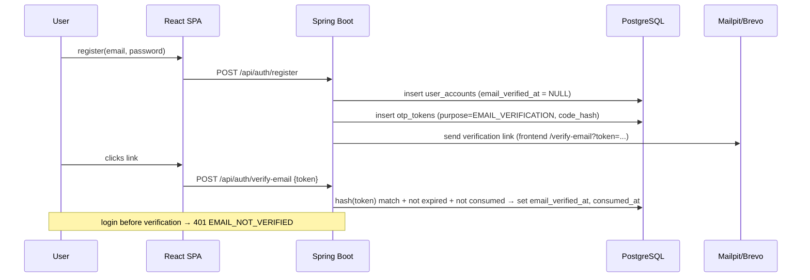
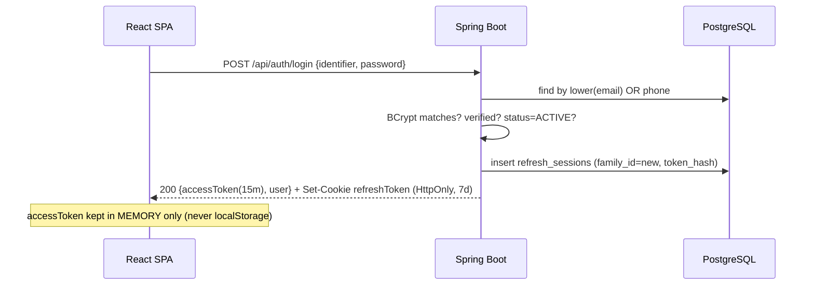
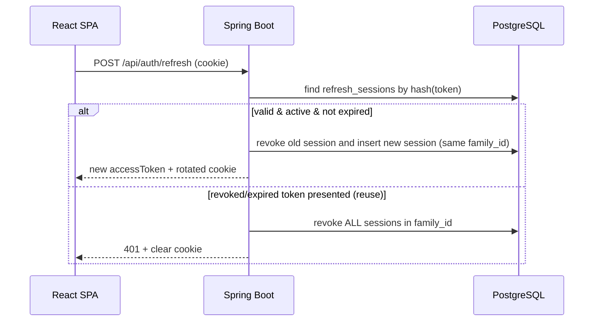
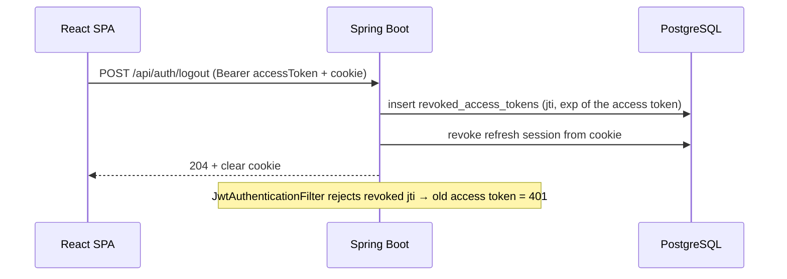
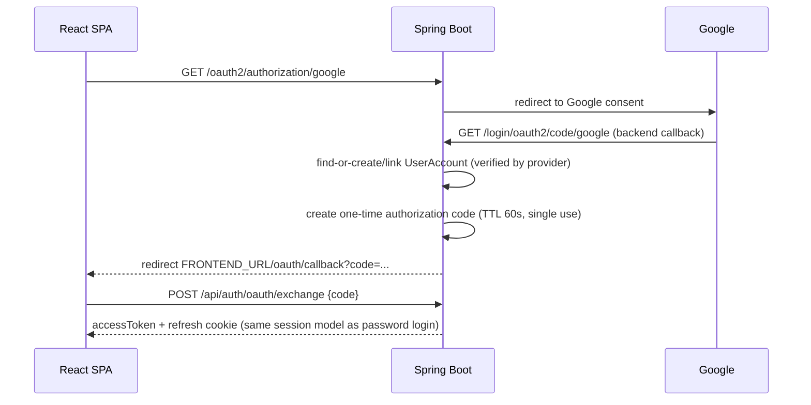
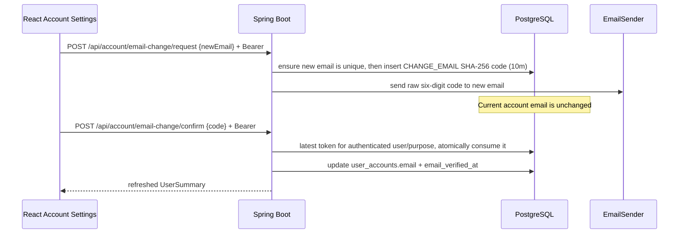

# AUTH FLOWS

## Registration + email verification

## Login (email or normalized phone + password)

## Refresh rotation + reuse detection

Silent refresh: on SPA load/401-expiry, React Query calls `/refresh` once (single-flight) and retries.

## Logout

## Token storage decisions (D4)

| Token | Where | Why |
|-------|-------|-----|
| Access | JS memory (React state/query cache) | XSS in localStorage exfiltrates tokens; memory dies with tab. Trade-off: F5 loses it → silent refresh. |
| Refresh | `HttpOnly; Secure(prod); SameSite=Lax; Path=/api/auth` cookie | JS cannot read it (XSS-safe); browser sends it only to refresh endpoints. |

- **CSRF**: refresh/logout are POST + `SameSite=Lax` (cross-site POSTs don't carry the cookie) + strict CORS
  allowlist (`FRONTEND_URL`, `allowCredentials=true`). If SameSite is ever relaxed, add CSRF tokens.
- **CORS**: single explicit origin, credentials allowed, no `*`.
- **401 vs 403**: 401 = not authenticated (bad/expired/revoked token, bad credentials, unverified email with
  code `EMAIL_NOT_VERIFIED`); 403 = authenticated but lacks role. Consistent error JSON everywhere.

## OAuth (P0-B, Google first)

**Never** place JWTs in the redirect URL query params.

Implemented details:
- Google client registration bean exists only when both credentials are non-blank; no-secret local/test startup remains valid.
- Spring Security validates OIDC state, nonce, signature and `email_verified`; callback code TTL is 60 seconds.
- `oauth_identities(provider, provider_subject)` links stable provider identity separately from mutable email.
- Existing matching email is linked and marked verified; otherwise a USER/profile is created with an unguessable
  BCrypt placeholder (no usable password is invented).
- Redirect code is URL-safe, DB stores SHA-256 only, and an atomic conditional update permits one exchange.
- React removes `?code=` from browser history before POSTing it, then uses the normal memory access token + HttpOnly refresh cookie.
- A transient `JSESSIONID` stores OAuth authorization state only and is invalidated by success/failure handlers.

## Change registered email (P0-B)

Wrong code hashes are constant-time compared. Each failed attempt is recorded in `REQUIRES_NEW`, because the
outer request deliberately throws 400 and would otherwise roll the counter back. Five failures lock the token;
resend cooldown is 60 seconds. Confirmation rechecks the unique email immediately before flush, and duplicate
races return 409. The existing JWT remains valid because identity is the immutable UUID `sub`, not email.

## Phone OTP login (mocked delivery)

- Public request response is identical for missing, disabled and active numbers; repeated active requests inside
  60 seconds also return the generic 200 while sending only once.
- `PHONE_LOGIN` code TTL is five minutes and reuses the same user/purpose binding, SHA-256, constant-time
  comparison, committed five-attempt lockout and atomic single-use consumption.
- Successful confirmation issues the normal access JWT + rotating refresh cookie; phone possession is the proof,
  so an otherwise active account does not require prior email verification for this alternate login.
- `FakeSmsSender` exists only in local/test, stores raw codes in process memory and never logs them. Local demo
  retrieval is an ADMIN-authorized, local-profile-only outbox; HTTP response redaction hides `phone` and `code`.
- Non-local/test profile without configured Brevo credentials uses `UnavailableSmsSender` and clearly reports that a real gateway is not configured.

## Phone OTP login (credential-conditional Brevo delivery)

The business flow is unchanged when delivery is real: `PhoneOtpService.request` normalizes the registered
phone, creates a five-minute `PHONE_LOGIN` token and sends the generated six-digit code through `SmsSender`.
The service method is transactional, so a known delivery failure rolls the new token row back and the user can
retry rather than receiving a misleading usable code.

Sender selection is explicit and mutually exclusive:

| Environment/configuration | Sender | Behavior |
|---|---|---|
| `local` or `test` | `FakeSmsSender` | In-memory delivery only; no Brevo request |
| non-local/test + `SMS_PROVIDER=brevo` + nonblank `BREVO_SMS_API_KEY` | `BrevoSmsSender` | `POST https://api.brevo.com/v3/transactionalSMS/sms` |
| other non-local/test configuration | `UnavailableSmsSender` | Existing `SMS_DELIVERY_UNAVAILABLE` response |

Brevo receives `api-key`, configured sender, normalized recipient and the transactional OTP message. Provider
4xx/5xx responses, timeouts and network failures map to the safe application error; raw phone, OTP, API key
and provider response bodies are not logged or returned. Brevo SMS is prepaid; this repository includes no live
credential and makes no live-delivery claim.
