# ERD

Implemented now: auth-core including Google/Facebook identities/exchange, catalog, Shelf Aura enrichment, `loans`, and singleton `system_configuration` (through Liquibase `0012`). Later audit/recommendation tables remain planned.

```mermaid
erDiagram
    roles ||--o{ user_account_roles : assigned
    user_accounts ||--o{ user_account_roles : has
    user_accounts ||--|| member_profiles : "1-1"
    user_accounts ||--o{ refresh_sessions : owns
    user_accounts ||--o{ otp_tokens : receives
    user_accounts ||--o{ oauth_identities : links
    user_accounts ||--o{ oauth_exchange_codes : exchanges
    member_profiles ||--o{ loans : borrows
    books ||--o{ loans : "loaned as"
    books ||--o{ book_authors : has
    authors ||--o{ book_authors : writes
    books ||--o{ book_categories : in
    categories ||--o{ book_categories : tags
    books ||--o{ book_tags : has

    roles { bigint id PK  varchar name UK }
    user_accounts {
        uuid id PK
        varchar email UK "normalized lowercase"
        varchar phone UK "nullable, normalized"
        varchar password_hash
        varchar status "ACTIVE | DISABLED"
        timestamptz email_verified_at "null = unverified"
        timestamptz created_at
        timestamptz updated_at
    }
    member_profiles {
        uuid id PK
        uuid user_account_id FK "unique"
        varchar full_name
        date date_of_birth
        varchar address
    }
    refresh_sessions {
        uuid id PK
        uuid user_account_id FK
        varchar token_hash UK "SHA-256, raw token never stored"
        uuid family_id "rotation lineage; reuse revokes family"
        timestamptz expires_at
        timestamptz revoked_at "null = active"
        varchar ip
        varchar user_agent
    }
    revoked_access_tokens { varchar jti PK  timestamptz expires_at }
    oauth_identities {
        uuid id PK
        uuid user_account_id FK
        varchar provider "GOOGLE"
        varchar provider_subject "stable provider id"
    }
    oauth_exchange_codes {
        uuid id PK
        varchar code_hash UK "SHA-256; raw code only in redirect"
        uuid user_account_id FK
        timestamptz expires_at "60 seconds"
        timestamptz consumed_at "single use"
    }
    otp_tokens {
        uuid id PK
        uuid user_account_id FK "nullable for phone-login targets"
        varchar target "email / phone / new-email payload"
        varchar purpose "EMAIL_VERIFICATION | PASSWORD_RESET | CHANGE_EMAIL | PHONE_LOGIN"
        varchar code_hash "SHA-256"
        int attempts "max 5"
        timestamptz expires_at
        timestamptz consumed_at "one-time use"
        timestamptz last_sent_at "resend cooldown 60s"
    }
    books {
        uuid id PK
        varchar title
        varchar isbn UK
        int publication_year
        int page_count "nullable; aura time/intensity signal"
        int total_quantity
        int available_quantity "check >= 0"
        boolean active "soft delete"
        timestamptz deleted_at
    }
    authors { uuid id PK  varchar name }
    categories { uuid id PK  varchar name UK }
    book_tags { uuid book_id FK  varchar tag PK "free-form aura label" }
    loans {
        uuid id PK
        uuid member_profile_id FK
        uuid book_id FK
        timestamptz borrowed_at
        timestamptz due_at
        timestamptz returned_at "null = active loan"
    }
```

## Entity identity strategy (decision D7)

- Surrogate **UUID PK** generated by Hibernate; `equals/hashCode` use **only the PK**, with a
  **constant `hashCode`** (`getClass().hashCode()`) so behavior is stable before/after persist.
- **Never** mutable business fields (email can change) and never lazy relations in identity.
- No Lombok `@Data` on entities (`@Getter`/`@Setter` only); no `CascadeType.ALL` by default;
  join ownership documented per relation (e.g., `Book` owns `book_authors`, `UserAccount` owns `member_profiles`).
